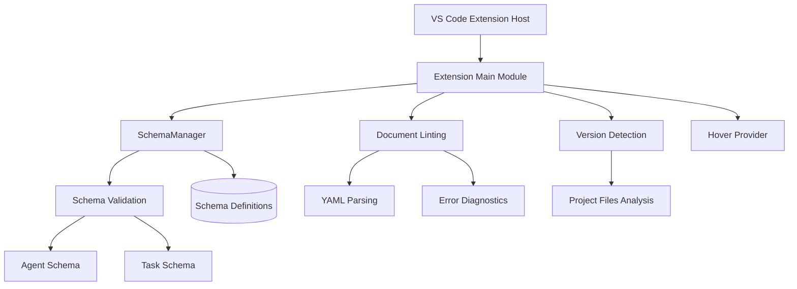
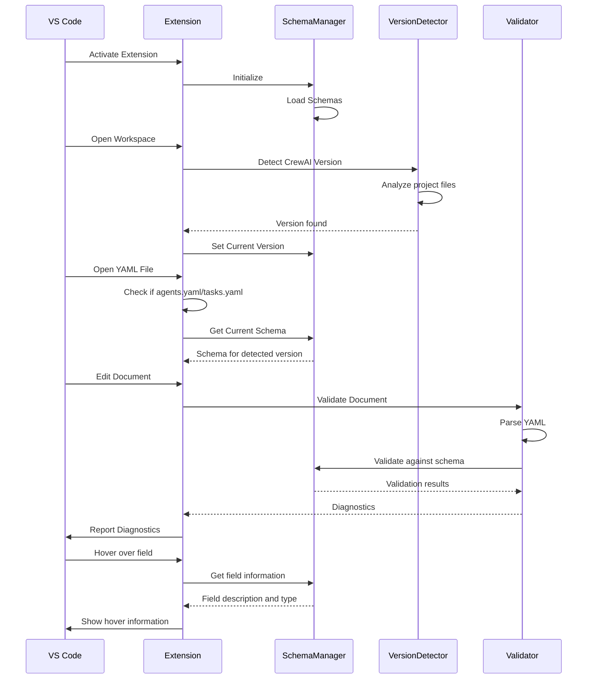

# CrewAI Lint Architecture

This document provides an architectural overview of the CrewAI Lint VS Code extension, which offers linting and validation for CrewAI YAML configuration files.

## Overview

CrewAI Lint is designed as a VS Code extension that provides real-time validation, error checking, and schema-based hover information for CrewAI configuration files (`agents.yaml` and `tasks.yaml`). The extension detects the version of CrewAI being used in a project and applies the appropriate validation schema.

## System Components

## Workflow

## Core Components

### Extension (`extension.ts`)

The main entry point that:
- Activates the extension when YAML files are opened
- Sets up document listeners for validation
- Handles hover information
- Manages diagnostic collections
- Cross-validates agent references in tasks

### SchemaManager (`schemaManager.ts`)

Central component responsible for:
- Loading and maintaining schemas for different CrewAI versions
- Setting the current schema version based on workspace detection
- Providing validation functions for agents and tasks
- Returning schema metadata for hover information

### Version Detection (`versionDetection.ts`)

Utility for:
- Analyzing project files (requirements.txt, pyproject.toml, poetry.lock)
- Detecting the CrewAI version being used
- Normalizing version strings

### Schema Definitions (`schemas/`)

Directory containing:
- Version-specific schemas (e.g., 0.102.0)
- Each version directory contains:
  - `agent.ts` - Schema for agent configuration
  - `task.ts` - Schema for task configuration
  - `index.ts` - Exports the complete schema for the version

### Utils (`utils/`)

Helpers that provide:
- Generic validation functions
- Type checking
- Error formatting

## Data Flow

1. The extension activates when a YAML file is opened
2. SchemaManager loads available schemas from the schemas directory
3. The extension detects the CrewAI version from workspace files
4. When editing a YAML file, the document is parsed and validated against the appropriate schema
5. Validation errors are converted to VS Code diagnostics and displayed
6. Hover information is provided based on schema definitions
7. Cross-validation is performed to ensure agent references in tasks are valid

## Technical Specifications

- **Language:** TypeScript
- **VS Code API:** Uses Diagnostic Collection, Hover Provider, and Document Change events
- **Dependencies:** 
  - js-yaml for YAML parsing
  - VS Code Extension API
- **Schema Format:** Custom defined JSON schema-like format
- **Validation:** In-memory validation against schema definitions 